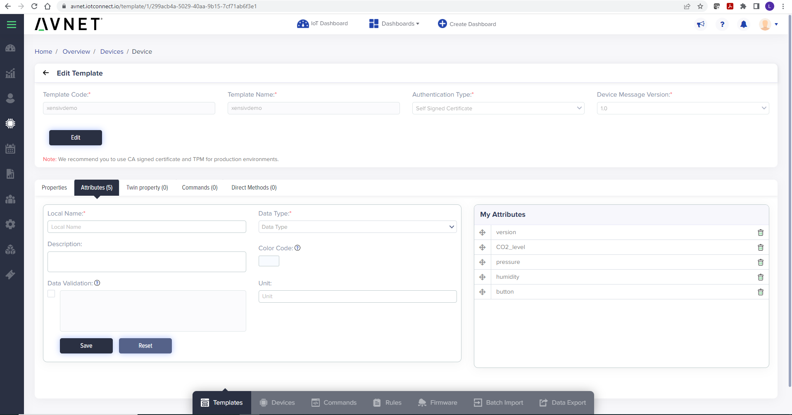
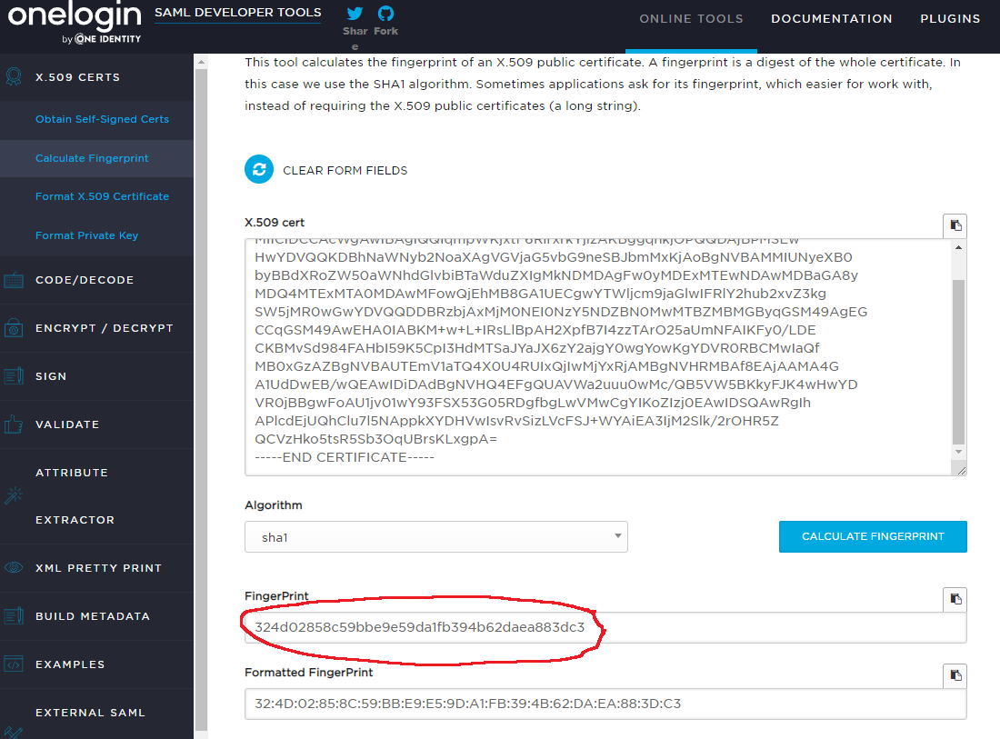
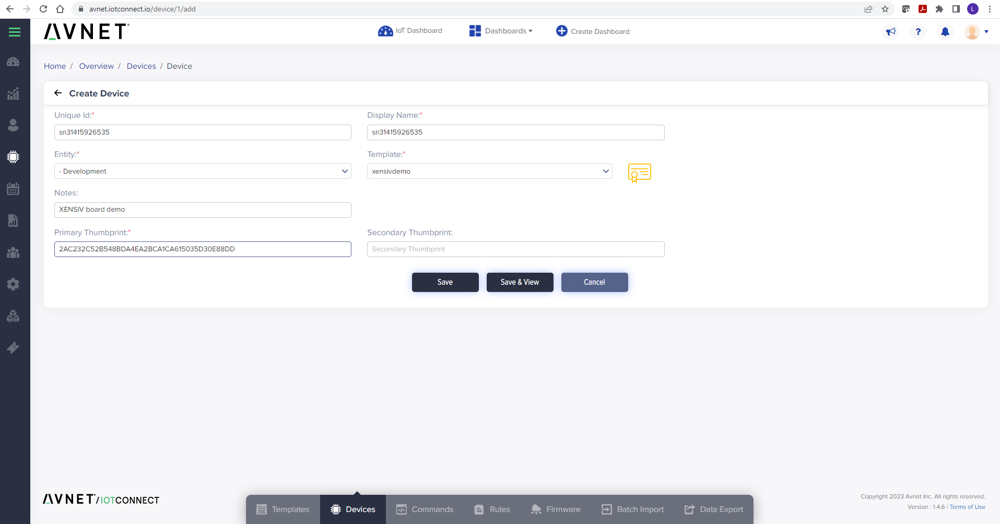

## Introduction

This document demonstrates the steps of setting up the Infineon [XENSIV&trade;  development kit](https://www.infineon.com/cms/en/product/evaluation-boards/kit_csk_pasco2/) 
for connecting to Avnet's IoTConnect Platform.

The built-in **Optiga secure element** provides a quick and secure way 
to set up the device with IoTConnect.

The dev kit uses the click board that has both PAS CO2 and pressure & temperature sensors. There are more click boards with 
different sesnors are supported by the dev kit. 

## Hardware Setup

* Press the sensor Click board onto Click interface of the base board.
* The base board needs to be connected to a USB port on your PC via the Micro USB cable.
* Once the board boots up, a new USB devices will be available. 
  * Optionally, connect a terminal program (like TeraTerm) to one of the two COM ports
which is named "USB Serial". Use defaults for 115200 baud: 8 bits, 1 stop bit, no flow control or parity. 
Firmware logs will be available on that COM port. 


## Software setup
- Download, install and open [ModusToolbox&trade; software](https://www.cypress.com/products/modustoolbox-software-environment). 
On Windows, ensure that you **Run As Adminstrator** the installation package so that the neccessary drivers can be installed.
- Select a name for your workspace when prompted for a workspace name.
- Click the **New Application** link in the **Quick Panel** (or, use **File** > **New** > **ModusToolbox Application**). This launches the [Project Creator](https://www.cypress.com/ModusToolboxProjectCreator) tool.
- Pick a board supported by the code example from the list shown in the **Project Creator - Choose Board Support Package (BSP)** dialog and click **Next**
- In the **Project Creator - Select Application** dialog, Click the checkbox of the project **Avnet IoTConnect Sensor Example** under **Sensing** catergory and then click **Create**. 
- Modify **Avnet_IoTConnect_Sensor_Example/configs/app_config.h** per your IoTConnect device and account info.
- Modify **Avnet_IoTConnect_Sensor_Example/configs/wifi_config.h** with your WIFI_SSID and WIFI_PASSWORD.
- At this point you should be able to build and run the application by using the options in the **Quick Panel** on bottom left of the screen.   
- You should see the application output in your terminal emulator.

## IoTConnect Template Setup

* Login to the IoTConnect platform, navigate to Devices -> Device -> Templates and click "Create Template."
  * Enter a name like "xensivdemo" for **Template Code** and **Template Name**. 
  * Select *Self Signed Certificate* or *CA Certificate* in the **Authentication Type** pulldown.
  * Ensure that **Device Message Version** is **1.0**
  * Click **Save**
* On the same page, click the Attributes tab.
* Add some Attributes to the list of attributes:
  * *version* - **STRING**
  * *temperature* - **NUMBER**
  * *humidity* - **NUMBER**
  * *CO2_level* - **NUMBER**
  * *button* - **NUMBER**
* The screenshot below shows an example template:



## Obtaining the Device Certificate Fingerprint

This section outlines how to set up the device for IoTConnect *Self Signed Certificate* or *CA Certificate* authentication type.
Steps for other authentication types are out of scope for this guide.

* Obtain the fingerprint of device certificate:
   * The device certificate is printed in the log of the terminal app once you program and run the application onto the board.
   * The fingerprint of the certificate can be either SHA256 or SHA1.
   * One can execute ``` openssl x509 -noout -fingerprint -inform pem -in cert.pem ``` if openssl is installed.
   * The contents of cert.pem can be pasted into an online fingerprint calculator such as [this one](https://www.samltool.com/fingerprint.php). 

Note that publishing the device certificate or fingerprint online is not technically unsafe 
because the certificate must be paired by the private key derived data during authentication. 
The private key is securely stored on the device and cannot be accessed even programmatically.
The only information that may potentially "leak" by using a public web site in this fashion is the informational 
manufacturer data, including the device serial number. Below is a sample screenshot:



## Setting up the Device in IoTConnect
 
* Navigate to Device -> Device and click the **Create Device** button.
* Enther your device unique ID.
* Choose your entity where you will create the device.
* Select the Template that was created in a previous step.
* Enter the fingerprint obtained in the previous step (without colons) as the **Primary Thumbprint**. See screenshot below.
* Click **Save**.


