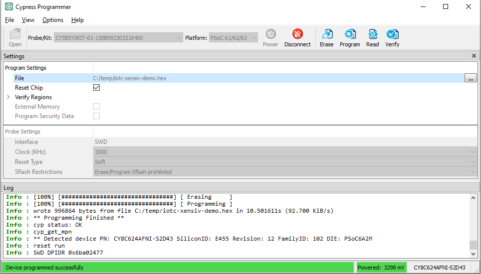

## Introduction

This document demonstrates the steps of setting up the Infineon XENSIV&trade; board
for connecting to Avnet's IoTConnect Platform using Optiga secure element.

## Hardware Setup

* The board needs to be connected to a USB port on your PC via the Micro USB cable.
* Once the board boots up, a new USB devices will be available. 
  * Optionally, connect a terminal program (like TeraTerm) to one of the two COM ports
which is named "USB Serial". Use defaults for 115200 baud: 8 bits, 1 stop bit, no flow control or parity. 
Firmware logs will be available on that COM port. 

## Program the prebuild Firmware
* Download the [ModusToolbox Programming Tools](https://www.infineon.com/cms/en/design-support/tools/programming-testing/psoc-programming-solutions/).
* Download the prebuild [Firmware](https://saleshosted.z13.web.core.windows.net/sdk/infineon/iotc-xensiv-demo-060723.zip).
* Launch the programmer software, **Open** the hex firwmare on the top left and Click **Connect**.
* Click **Program** button on the top right and wait for the propress bar to be done as the image shown below.
* If successful, the log will show up on the terminal program.
* For re-building the firmware, please refer to [DEVELOPER_GUIDE](https://github.com/avnet-iotconnect/iotc-modustoolbox-xensiv-example/blob/main/DEVELOPER_GUIDE.md).

  